== ECLİPSE-PYTHON KURULUMU
== İçindekiler +
. İçindekiler +
. Versiyon Geçmişi +
. Giriş +
. Eclipse IDE’sinin Mac Ortamında Kurulumu +
. Kurulum
.. Eclipse IDE’sinin Windows Ortamında Kurulumu +
.. Eclipse’e Python Eklentisi Kurmak +
. Windows'a Python Eklentisi Kurmak +
. Referanslar +

== 2)Versiyon Geçmişi +

|===
|Tarih|Değişiklik|Kişi

|20.10.2016
| Eclipse ve Python’un Mac Ortamında Kurulumu

|Gönül TOKTAY
|20.10.2016

|Eclipse ve Python’un Windows Ortamında Kurulumu
|Miraç Sıla GENÇ

|12.12.2016
|Düzenleme
|Merve Tafralı
|===

== 3)Giriş +
Projemizde Görüntü İşleme Algoritmaları kullanılacaktır. 
Bu algoritmaları geliştireceğimiz platform Eclipse ve programlama dili olarak Python kullanılacaktır. 
Bu yüzden Eclipse IDE’sinin Mac ve Windows ortamında kurulumunu anlatacağız. 
Eclipse kurulumu tamamlandıktan sonra Python Programlama Dilinin Eclipse ortamına nasıl eklenti olarak kurulduğunu göstereceğiz. +

== 4) Kurulum
*4.1 Eclipse IDE’sinin Windows Ortamında Kurulumu* +

Eclipse için birçok paket bulunmaktadır. İşletim sisteminize ve işlemcinize göre uygun versiyonu https://www.eclipse.org/downloads/ adresinden indirebilirsiniz. Biz son paketi olan Neon Packages 64 bit versiyonu kurulumunu anlatacağız. İşletim sistemimiz macOS Sierra olduğundan bu bölümde MacBook bilgisayarlar için kurulumunu anlatacağız. +
Yukarıda verdiğimiz linke tıkladığımız da Resim 1’de ki gibi ekran ile karşılaşırız.

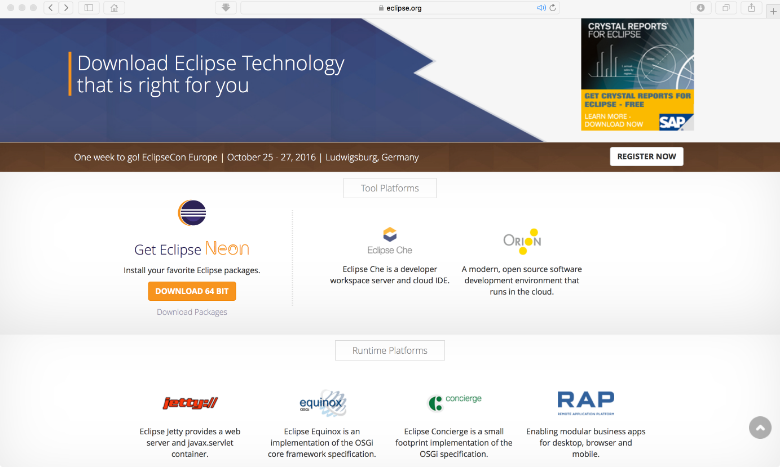
Resim 1. Eclipse Download sayfası. +

Buradan “DOWNLOAD 64 BIT “ butonuyla Eclipse Neon versiyonunu indirebilirsiniz. Ayrıca paketleri incelemek isterseniz indirme butonunun altında yazan “Download Packages” butonuna tıklayarak diğer paketleri inceleyebilirsiniz. İndirme işlemi bittikten sonra Resim 2’de gösterdiğimiz “İndirilenler” klasöründen indirdiğimiz dosyayı açıyoruz. +

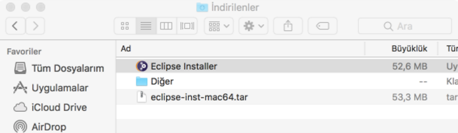 
Resim 2. İndirilenler klasörü. +
İndirdiğimiz eclipse dosyasına çift tıkladığımızda içinden yukarda görüldüğü gibi “Eclipse Installer” uygulaması çıkacaktır. Bu uygulamaya çift tıklayarak kurulumu başlatıyoruz. +
Kurulum başlarken ilk olarak hangi paketi indireceğimizi gösteren Resim 3 ekranından seçip devam ediyoruz. +

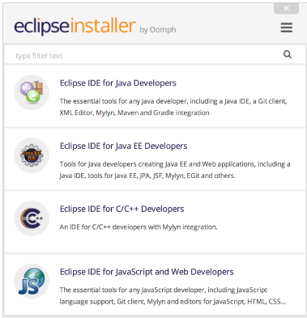
Resim 3. Eclipse kurulum sayfası. +

Biz burdan “Eclipse IDE for Java Developers” paketini seçtik. Burada istediğiniz paketi seçebilirsiniz. Çünkü önemli olan bilgisayarımızda Eclipse geliştirme ortamının bulunması, zaten eklenti olarak Python dilini kurulumunu gerçekleştireceğiz. Seçimimizi yaptıktan sonra aşağıdaki gibi bir ekran gelecek karşımıza, burdan “INSTALL” butonu ile devam ediyoruz. +

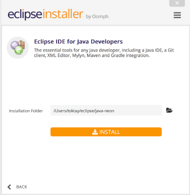
Resim 4. Install sayfası. +

Bu sayfada herhangi bir uyarı ile karşılaşırsanız bilgisayarınızda jre ve jdk sürümlerinin güncel olmadığını gösterir. Bizim bilgisayarımızda bu sürümler yüklü olduğu için herhangi bir sorun ile karşılaşmadan devam ettik. Eğer bir sorun ile karşılaşırsanız; http://download.eclipse.org/oomph/jre/?vm=2_1_8_0_64_0&pn=Eclipse%20IDE%20for%20Java%20Developers&pi=http://www.eclipse.org/downloads/images/java.png bu sayfadan iki eklentinin de işletim sisteminize göre güncel sürümünü indirebilirsiniz. Bu adımdan sonra kurulum ekranından devam edebilirsiniz.
“INSTALL” butonunu bastıktan sonra karşımıza gelen ekranda Lisans sözleşmesini kabul ettik ve yükleme başladı. +

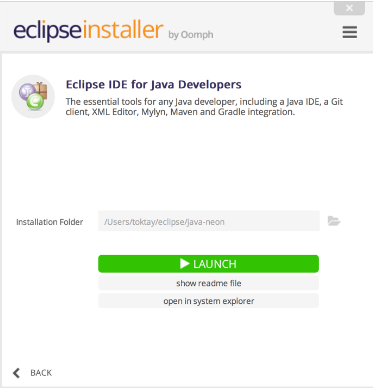 
Resim 5. Kurulumun son sayfası. +

Böylece kurulumu sonlandırmış olduk. “LAUNCH” butonu ile Eclipse IDE’sini başlatabiliriz. Karşımıza ilk olarak çalışmalarımızı hangi klasöre kaydetmek istediğimizi belirleyebileceğimiz Resim 6’da ki sayfa açılacaktır. Burada istediğimiz klasörü “Browse” butonuna tıklayarak seçiyoruz. Eğer Eclipse her açıldığında bunu sormasını istemiyorsanız “Use this as the default and do not ask again” kutucuğunu işaretleyerek devam edin. +

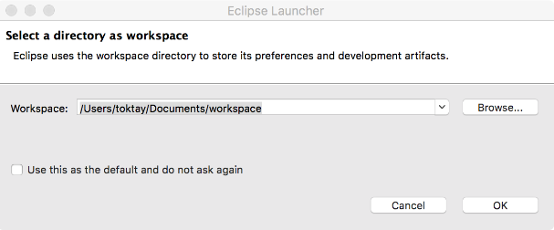
Resim 6. Klasör seçimi sayfası. +

Eclipse kurulumu ile ilgili anlatacaklarımız burada bitiyor. Klasörünüzü seçtikten sonra karşınıza son olarak Resim 7’de ki Eclipse başlangıç sayfası gelecektir.

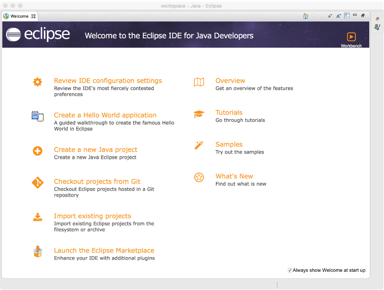
Resim 7. Eclipse başlangıç sayfası. +

*4.2.Eclipse IDE’sinin Windows Ortamında Kurulumu*

Eclipse IDE ‘sinin farklı bir paketi olan Windows işletim sistemi için uygun olanının kurulumu anlatılacaktır.
İndirme işlemi için https://www.eclipse.org/downloads/ adresinden Windows için uygun olan 64 bitlik seçim yapılarak kurulum gerçekleştirilecektir. +

Yukarıdaki linke bağlanıldığında karşımıza çıkan ekran şu şekildedir: +

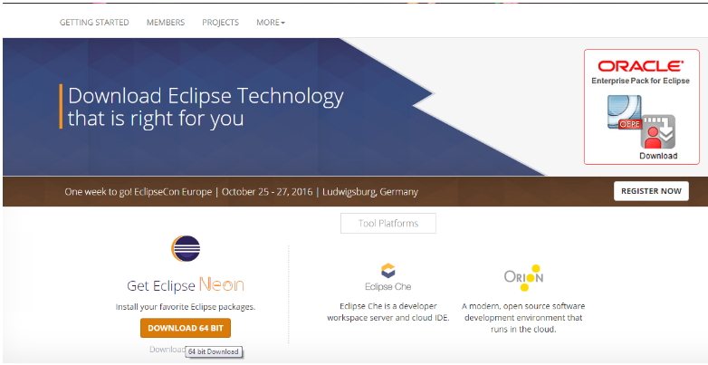 

	
Burada görülen  “DOWNLOAD 64 BIT “ butonuyla Eclipse Neon versiyonu bilgisayara indirebilir. 
Ayrıca paketleri incelemek isterseniz indirme butonunun altında yazan “Download Packages” butonuna tıklayarak diğer paketleri inceleyebilirsiniz. +

İndirme işleminin tamamlanmasının ardından  Karşıdan Yükle klasörüne indirilmiş olan exe dosyasına çift tıklıyoruz. +

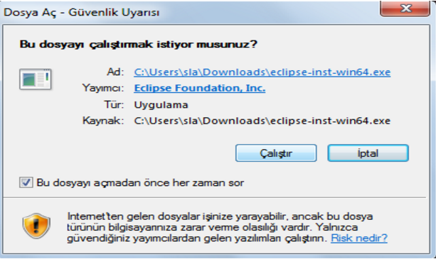
Burada ‘Çalıştır’ butonu tıkladıktan sonra; +

Karşınıza böyle bir hata çıkarsa internet ayarlarınız tam olup olmadığını kontrol ediniz. +

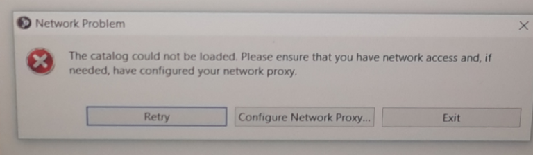 

Karşınıza böyle bir problem çıkmazsa, +

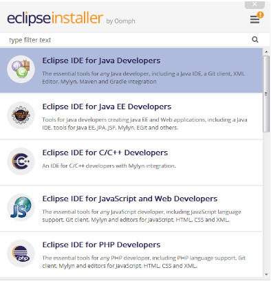

Resimde görüldüğü gibi seçili olan ‘Java Developers’ sekmesine tıklıyoruz. Kendi kullanımım için bu paketi seçmiş bulunmaktayım ancak önemli olan pketin kendisi değil,Eclipse ortamının kuruluyor olmasıdır. Phyton kurulumu zaten yapılacaktır. +

Herhangi bir sekmenin seçilmesinden sonra install etme işlemi gerçekleştirilecektir. İşlemin süreci aşağıdaki gibidir: +

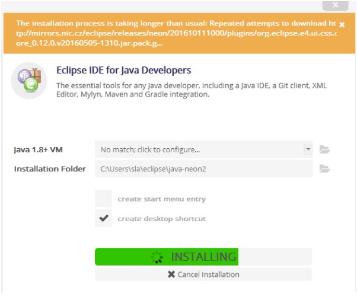 

Bu sayfada herhangi bir uyarı ile karşılaşılması durumunda bilgisayarınızda jre ve jdk sürümlerinin güncel olmadığını gösterir. + 

http://download.eclipse.org/oomph/jre/?vm=2_1_8_0_64_0&pn=Eclipse%20IDE%20for%20Java%20Developers&pi=http://www.eclipse.org/downloads/images/java.png
Sorunun çözümü için gerekli link yukarıda tanımlanmıştır. +

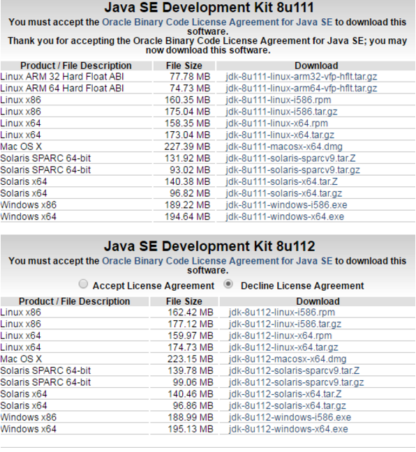

Kurulumun son aması olarak LAUNCH butonuna tıklanmalıdır. Kurulumun tamamlanması ardından Eclipse başlatılmış olacaktır. Dosyaların kaydedileceği dosya yolu seçilerek ‘Browse’ butonu  ile seçimimizi tamamlamış olacağız. +

Karşımıza çıkan başlangıç sayfası aşağıda görülmektedir. +

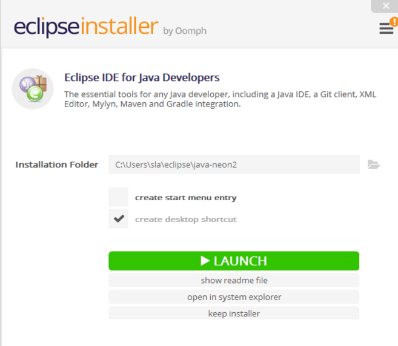

Linke tıklandığında açılan sayfa aşağıda gösterilmiştir. Bu sayfadan işletim sistemi için uygun olan versiyon indirilerek sorun çözülmüş olacaktır. +

== 5) Eclipse’e Python Eklentisi Kurmak +
Görüntü İşleme Algoritmaları için Python dilini kullanacağımızı belirtmiştik. Python dilini kullanabilmemiz için öncelikle PyDev paketini etkinleştirmemiz gerekmektedir. Bunun içinde ilk olarak terminalimizden Python’u kurulumu gerçekleştireceğiz. +
Terminal’i açmak için kısa yol olarak “cmd(⌘)+space” tuş kombinasyonunu kullanabilirsiniz ya da Resim 1’de ki gibi Spotlight aramasından (büyüteç simgesi) “Terminal” olarak aratabilirsiniz. +

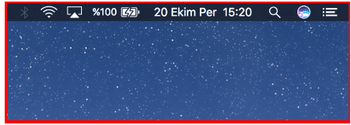
Resim 1. Spotlight aramasından Terminal’i açmak. +

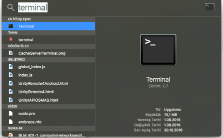
Resim 2. Spotlight ile Terminal’i açmak. +

Yukarıdaki gibi Terminal uygulamasına çift tıklıyoruz. Terminal ekranı Resim 3’de ki gibi açılacaktır. Buraya brew install python yazıyoruz. +

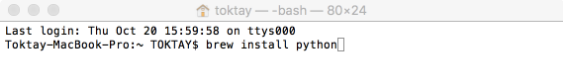
Resim 3. Terminal Ekranı. +

[[source,python]]
----

Last Login:Thu Oct 20 15:59:58 on ttys000

Toktay-Macbook-Pro:~ Toktoy$ brew install python

----

Bu komut ile python’u indiriyoruz. Kurulum işlemi bittikten sonra python komutunu terminalden çalıştırarak kurulumun yapılıp yapılmadığını kontrol edebilirsiniz. Eğer Resim 4’de ki gibi “python” yazdığımızda Python 2.7.10 sürümüne giriş yapılabiliyorsa kurulum sağlanmıştır. +

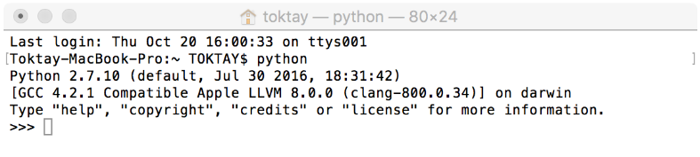
Resim 4. Python kurulum kontrolü. +

[[source,python]]
----

Last Login:Thu Oct 20 16:00:33 on ttys0001

Toktay-Macbook-Pro:~ Toktoy$  python

Python 2.7.10 (default, Jul 30 2016, 18:31:42)

[GCC 4.2.1 compotible Apple LLVM 8.0.0 (clang-800.0.34)] on darwin
Type "help","copyright","credits" or "license" for more information.
>>>

----

Python’un kurulu olduğundan da emin olduktan sonra artık Eclipse ile Python’u birbiribe bağlamamız gerekmektedir. Bunun için Eclipse’i açıyoruz ve Help menüsünden Resim 5’de görüldüğü gibi “Install New Software” seçeneğine tıklıyoruz. +

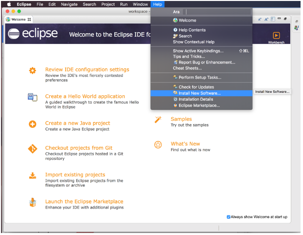
Resim 5. Help menüsü ve “install new software” seçeneği. +

Karşımıza gelecek Install sayfası burada Add butonuna tıklıyoruz. +

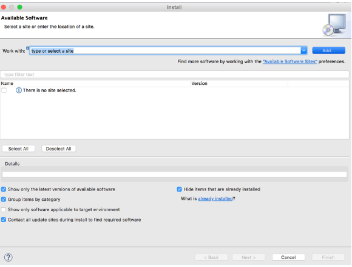
Resim 6. Install sayfası. +

Add Repository sayfasında Name ve Location bilgilerini aşağıdaki şekilde dolduruyoruz.
Name: PyDev and PyDev Extensions 
Location: http://pydev.org/updates +

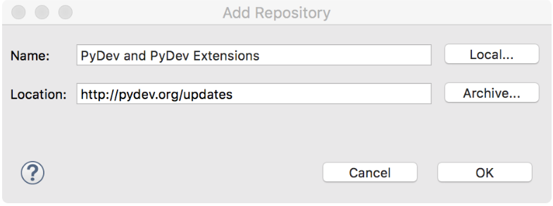
Resim 7. Ekleme sayfası. +

Bilgileri doldurduktan sonra “Ok” tuşuna basıyoruz. Böylece Eclipse PyDev eklentisini arayacaktır. Bu sırada Install sayfasında “Pending” yazısını göreceksiniz. Kaynaklar bulunduğunda sayfada aşağıdaki gibi iki dosya görünecektir. “PyDev” kutucuğuna işaretledikten sonra “Next” butonuna tıklayarak devam ediyoruz.  +

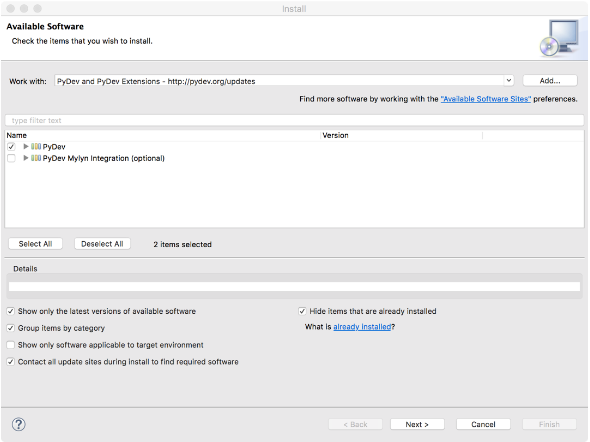
Resim 8. PyDev eklentisi kurulumu.

Gelen ekranda tekrar indirilen paketler hakkında bilgi verilecektir, tekrar “Next” butonuna basıyoruz. Bundan sonra gelen ekran Resim 9’da ki gibi “Lisans Sözleşmesi” ekranı olacaktır. Burada “I accept the terms of the license agreements” seçeneğine tıklıyoruz ve “Finish” butonuna basıyoruz. +

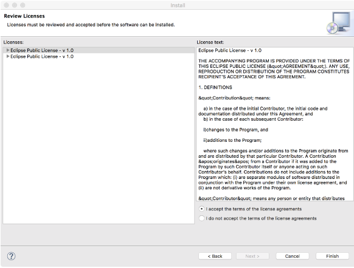
Resim 9. Lisans Sözleşmesi. +

Kurulumun gerçekleştiğini göreceğiniz bir yükleme ekranı gelecektir. Bu yükleme bittikten sonra Resim 10’da ki gibi Eclipse için yeniden başlatma isteyecektir. “Yes” butonu ile yeniden başlatabilirsiniz. +

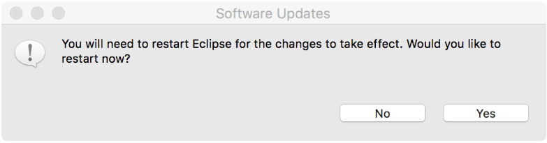
Resim 10. Yeniden başlatma onayı. +

Eclipse yeniden açıldığında Resim 11’de gösterildiği gidi menü çubuğundan Eclipse’e tıklayıp “Servisler” seçeneğine tıklıyoruz. +

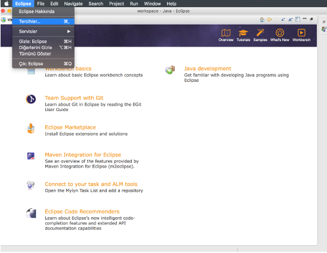
Resim 11. Eclipse -> Tercihler seçeneği.

Tercihler sayfasında Resim 12’de belirtildiği gibi *PyDev -> Interpreters -> Python* Interpreter seçeneğine tıklıyoruz. Burada Python paketlerini bulmak için lokasyon belirtmemiz gerekiyor. Eğer Python paketlerinizin hangi dizin altında olduğunu bilmiyorsanız açık olan sayfada sağ tarafta göreceğiniz “Quick-Auto Config” butonuna tıklayarak lokasyon bilgilerinin otomatik olarak doldurulmasını sağlayabilirsiniz. Resim 13’de “Quick-Auto Config” butonuna tıklandıktan sonra ki hali gösterilmektedir. +

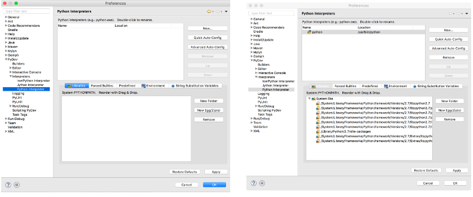
Resim 12. Tercihler sayfası.			      Resim 13. Otomatik olarak doldurulmuş hali. +

Son olarak “Ok” butonu ile Tercihler sayfasından da çıkıyoruz. Böylece PyDev kurulumunu da bitirmiş olduk. PyDev de yeni bir proje oluşturmak için Eclipse’i açıyoruz. File -> New -> Other seçeneğine tıklıyoruz. +

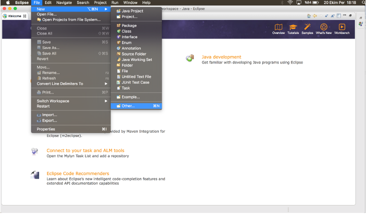
Resim 14. Yeni proje açmak. +

Aşağıda gördüğümüz ekranda PyDev -> PyDev Project seçeneğine tıklıyoruz ve “Next” butonuyla ilerliyoruz. +

image::r29.png[5 resim 15]
Resim 15. PyDev Project seçimi. +

Açılan sayfada projeminizin ismini yazıyoruz. Ayrıca alt kısımda “Creatr ‘src’ folder and add it to the PYTHONPATH” kutucuğunu işaretleyip “Finish” butonuna tıklıyoruz. +

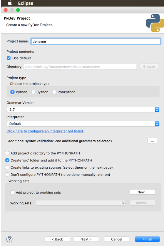
Resim 16. Proje bilgilerini girme. +

Projemizi oluşturduk fakat göremiyorsanız Eclipse Welcome ekranını kapatırsanız, Eclipse IDE sayfasının sol tarafında “PyDev Package Explorer “ sekmesini göreceksiniz. Burada bizim “deneme” adıyla oluşturduğumuz projenin altında bulunan “src” öğesine sağ tıklayarak New -> PyDev Module seçeneğine tıklıyoruz. +

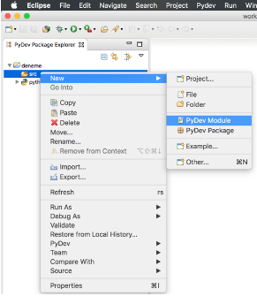
Resim 17. PyDev New Module seçeneği. +

Buradan “Name” kısmını doldurarak “Finish” butonuna basıyoruz. +

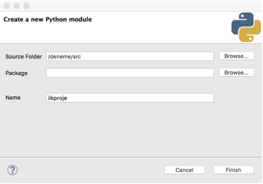
Resim 18. +

Python projemizi de bu şekilde açmış olduk. Artık Python dilinde kodlama yapabilir ve uygulamalarımızı geliştirebiliriz. +

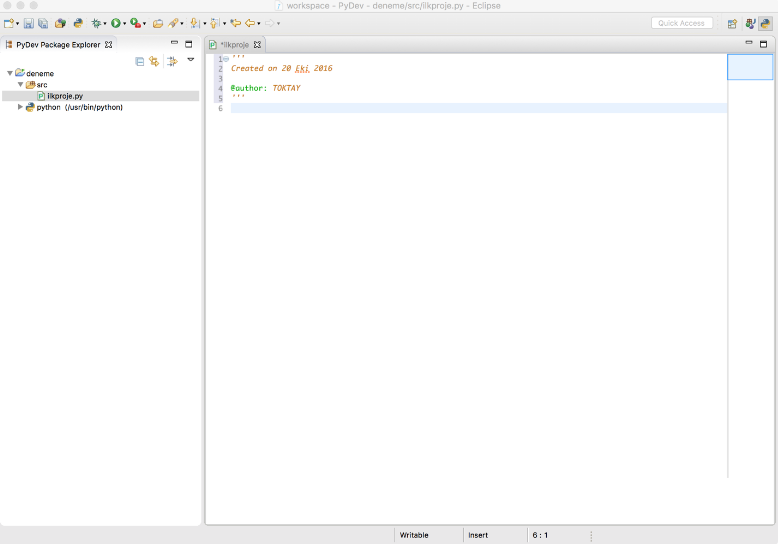

== 6) Windows'a Python Kurulumu 
Windows'a Python kurulumu için, https://www.python.org/downloads/ adresinden *Download Python 2.7.12* indiriniz. +

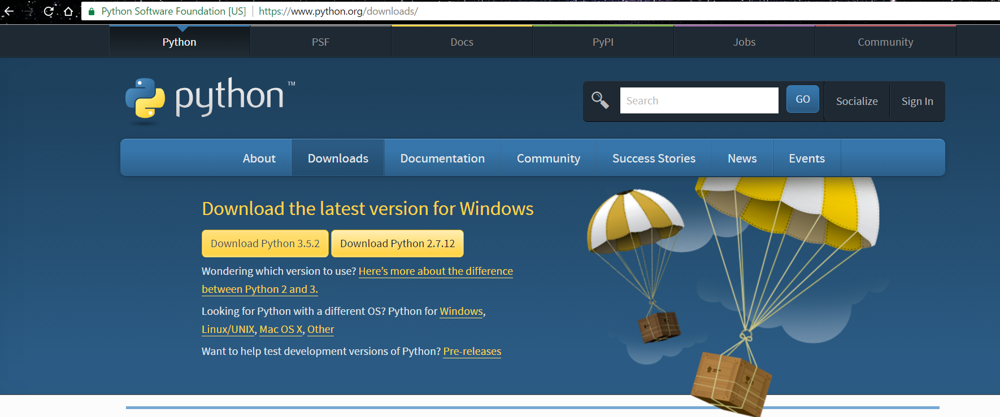
Resim 1: Python İndirme Sayfası +

İndirme işlemi bittikten sonra Resim 2 de açılan pencerede "install for all users" seçeneğini seçtin ve Next buyonuna basınız.

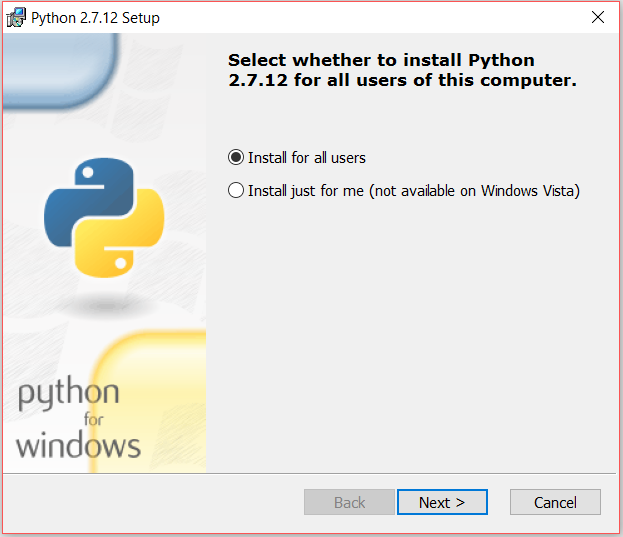
Resim 2: Python İndirme  +

Yeni açılan sayfada "next" butonunu seçiniz.

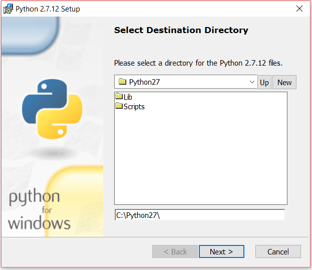
Resim 3: Python İndirme +

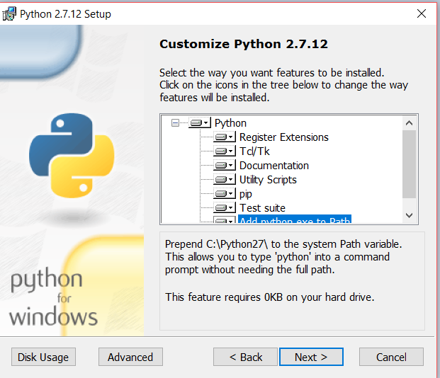
Resim 4: Python İndirme +

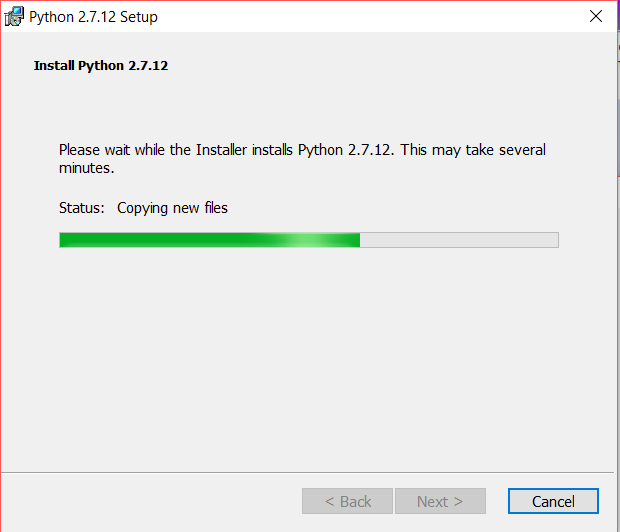
Resim 5: Python İndirme +

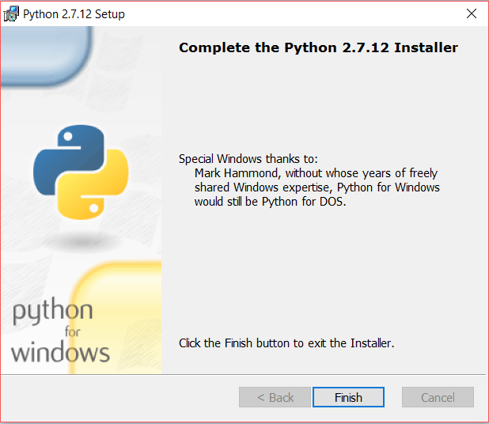
Resim 6: Python İndirme +

Yükleme işlemi tamamladıktan sonra "Finish" butonuna basınız.

Tüm işlemleri yaptıktan sonra programda syntax hatası veriyor ise yada program çalışmıyorsa, bilgisayarınızda sadece python sürümünün  
2.7’si olup olmadığını kontrol ediniz. +
Eğer bilgisayarınızda Python’a ait başka sürümler varsa denetim masasından kaldırıp sadece 2.7 sürümü olduğundan emin olunuz. +

